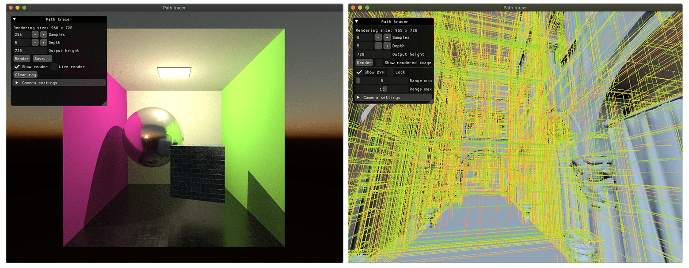
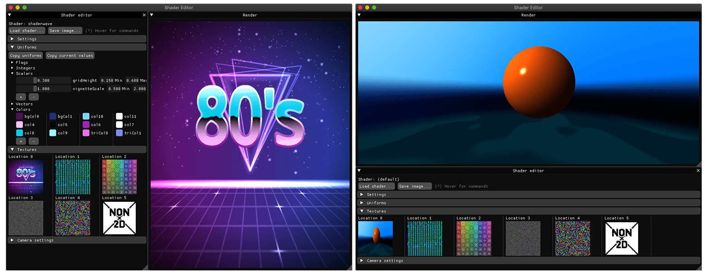
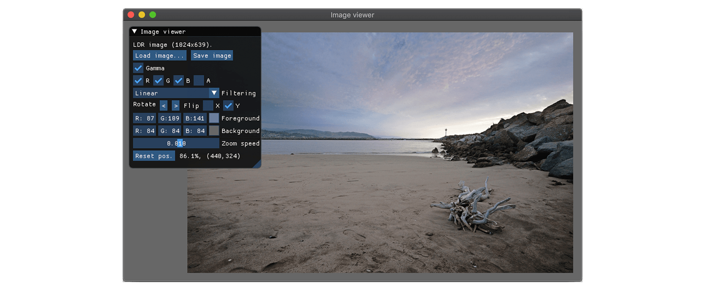
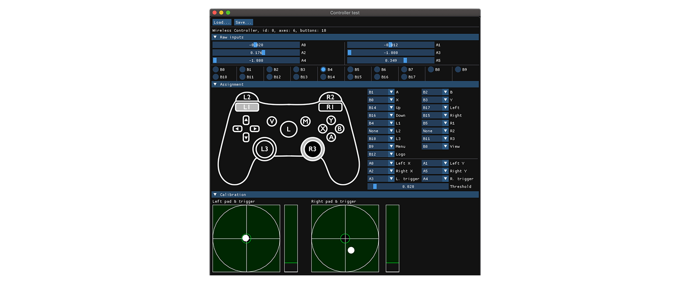

# Rendu Documentation

Rendu is a rendering engine designed for experimentation. The computer graphics academic and industrial litterature is full of interesting techniques and approaches than can be cumbersome to implement without some basic building blocks. This project aims to provide those building blocks, along with examples of interesting methods or papers. It also contains more general demo applications, such as a small snake game or a gamepad configurator.

Rendu requires OpenGL 4 and builds on macOS (main test machine), Windows (regular testing) and Linux. After cloning the Rendu repository, see the [Building](#building) section to get the engine running! You can also check [the full documentation](https://kosua20.github.io/Rendu-documentation/).

Basic resources to run each project are included in this repository, but you can download many additional scenes from an [auxiliary repository](https://github.com/kosua20/Rendu-resources) for some of the applications.

# Projects

## Applications

| Name  | Description |
| ------------- | ------------- |
| [Physically based rendering](http://kosua20.github.io/Rendu-documentation/group___p_b_r_demo.html) |  Real-time rendering of a scene with 'physically-based' materials (GGX BRDF introduced in *Microfacet Models for Refraction through Rough Surfaces*, Walter et al., 2007), using deferred or forward rendering, real-time lighting environment and shadows update, and an HDR pipeline with bloom, depth of field and ambient occlusion. |
| [Path Tracer](http://kosua20.github.io/Rendu-documentation/group___pathtracer_demo.html) |  Offline unidirectional path tracing for textured materials using Lambert+GGX BRDF with importance sampling. Supports stratified sampling, jittering, next event estimation, environment lighting contribution, emissive objects. Relies on a raycaster with a BVH for fast intersection queries against triangular meshes. Comes with an interactive viewer where the BVH levels can be displayed, and the camera placed for rendering. |
| [Island and ocean rendering](http://kosua20.github.io/Rendu-documentation/group___island.html) |  Real-time rendering of an ocean and island, using tesselation, Gerstner waves, custom sand and water shading. Underwater rendering is achieved using absorption/scattering tables, depth based blur and caustics mapping. Sand rendering is performed using high-frequency detail data and triplanar mapping.  |
| [Image Filtering](http://kosua20.github.io/Rendu-documentation/group___image_filtering.html) |  Apply filters to an image, such as gaussian blur, box-blur, approximate flood-fill (*Jump Flooding in GPU with Applications to Voronoi Diagram and Distance Transform*, Rong et al., 2006) and poisson filling (*Convolution Pyramids*, Farbman et al., 2011), etc. |
| [Shader playground](http://kosua20.github.io/Rendu-documentation/group___shader_bench.html) |  Interactive shader viewer with editable inputs (uniforms, textures) and camera parameters for raymarching, noise generation,... |
| [Atmospheric scattering](http://kosua20.github.io/Rendu-documentation/group___atmospheric_scattering.html) |  Realistic atmosphere rendering with Rayleigh and Mie scattering (*Precomputed Atmospheric Scattering*, Bruneton et al., 2008). |
| [Snake Game](http://kosua20.github.io/Rendu-documentation/group___snake_game.html) |  A basic game of snake, demonstrating game menus, player state, batched rendering. |

## Tools

| Name  | Description |
| ------------- | ------------- |
| [Image viewer](http://kosua20.github.io/Rendu-documentation/group___image_viewer.html) |  Basic image viewer and editor for LDR and HDR images, supporting rotations, channels toggling, color picking. |
| [BRDF Estimator](http://kosua20.github.io/Rendu-documentation/group___b_r_d_f_estimator.html) |  Compute data for image-based lighting from an environment map: pre-convolved irradiance, BRDF look-up table, ambient lighting spherical harmonics decomposition. |
| [Controller mapper](http://kosua20.github.io/Rendu-documentation/group___controller_test.html) |  Interface to create and edit controller button/stick mappings. |
| [Shader validator](http://kosua20.github.io/Rendu-documentation/group___shader_validator.html) |  Perform per-shader compilation against the GPU driver and reports errors in an IDE-compatible fashion. |
| [Atmospheric scattering preprocess](http://kosua20.github.io/Rendu-documentation/group___atmospheric_scattering.html) |  Compute the atmosphere coefficients look-up table for the Atmospheric Scattering project. |
| [Playground](http://kosua20.github.io/Rendu-documentation/group___playground.html) |  Simple application setting up a rendering context for small experimentations. |

# Building

This project use `premake5` ([premake.github.io](https://premake.github.io)) for generating the workspace and projects files.
After cloning Rendu, move to the root of the repository and run

    premake5.exe [vs2019 | xcode | make | ...]

To generate the desired workspace in the `build` directory.

The documentation (access it at `docs/index.html`) relies on Doxygen being installed. Generate it with

    premake5 docs

You can clean the build directory with

    premake5 clean

All non-system dependencies are compiled directly along with the projects. The only exception is `gtk3` on Linux.

# Features

On a more detailed level, here are the main features you will find in Rendu.

- Window and graphics context setup.
- GPU objects creation and management (shaders, textures, buffers).
- Resources handling and packing.
- Shader validation at compilation time, with automatic location handling.
- Input management with controllers support.
- 3D rendering, including per-fragment shading, normal maps, parallax mapping.
- Lights: omni/spots/directional lights, batched variance shadow mapping for all lights.
- Environment lighting, using cubemaps updated in real-time, preconvolved irradiance maps and spherical harmonics (also updated on the fly).
- Linear lighting pipeline, with HDR, bloom, tonemapping and gamma correction.
- Depth of field with controllable focal plane and in-focus band.
- Screen space techniques: antialiasing (FXAA), ambient occlusion.
- Image processing techniques, such as fast gaussian blur, Poisson inpainting, flood filling.
- 2D interface rendering (buttons, checkboxes) with support for font distance fields.
- A raycaster CPU implementation using a bounding volume hierarchy.
- Path tracer with GGX importance sampling.
- Generation and rendering of a terrain using Perlin noise, erosion and fixed grid geometry.
- Ocean rendering using a tesselated plane, far-distance proxy and absorption/scattering look-up table.

## Planned

I would like to add some additional features to Rendu in the near future, mainly to get a better grasp of some techniques and allow for more experimentations.

- Local light probes using parallax correction.
- Temporal Antialiasing with reprojection and clamping.
- Screen-space reflections and shadows (raymarching against the depth buffer).
- Particle effects (updated on the GPU).
- Volumetric effects, such as godrays and lit fog.
- Support interesting controllers (MIDI controllers, PS4 light bar and touchpad,...)

On a more down-to-earth level, some engineering tasks could also help improve the engine.

- Cleanup the way materials are handled right now.
- Potential move to Vulkan?
