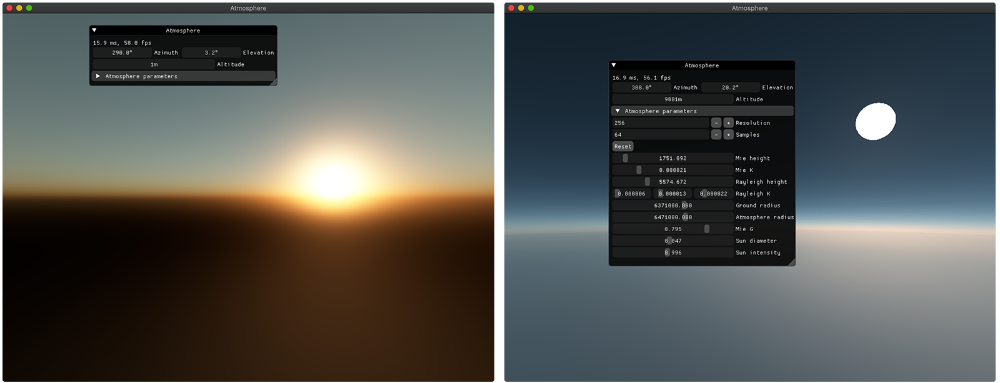
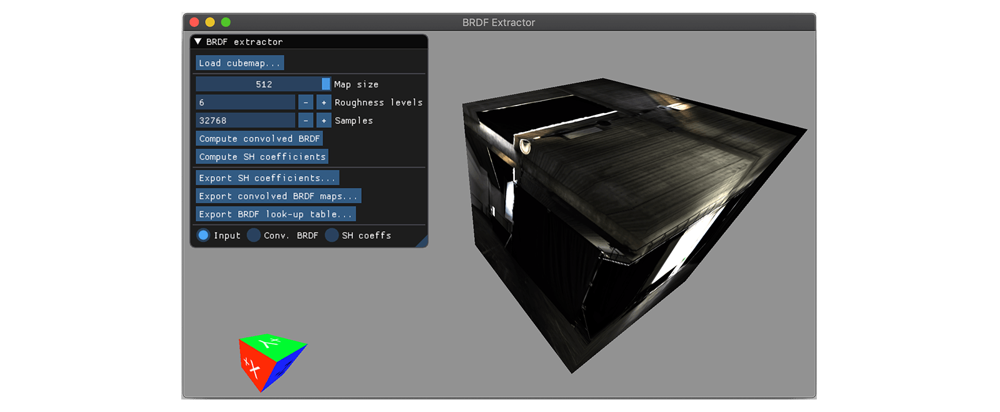
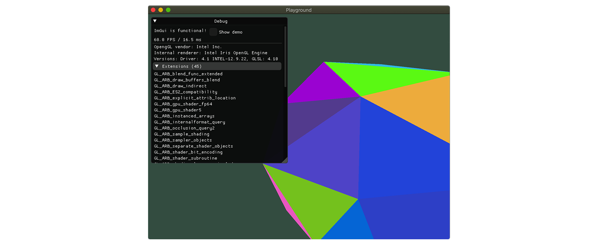

# Rendu Documentation

Rendu is a rendering engine designed for experimentation. The computer graphics academic and industrial litterature is full of interesting techniques and approaches than can be cumbersome to implement without some basic building blocks. This project aims to provide those building blocks, along with examples of interesting methods or papers. It also contains more general demo applications, such as a small snake game or a gamepad configurator. Rendu requires OpenGL 4 and builds on macOS (main test machine), Windows (regular testing) and Linux. After cloning the Rendu repository, see the [Building](#building) section to get the engine running! You can also check [the full documentation](http://kosua20.github.io/Rendu/html/index.html).
Resoures to run each project are included in this repository, but you can download additional scenes from an [auxiliary repository](https://github.com/kosua20/Rendu-resources) for some of the applications.

# Projects

## Applications

Name  | Description
------------- | -------------
[Deferred Physically based rendering](http://kosua20.github.io/Rendu/html/group___deferred_rendering.html) | Real-time rendering of a scene with 'physically-based' materials (GGX BRDF introduced in *Microfacet Models for Refraction through Rough Surfaces*, Walter et al., 2007), using deferred rendering and an HDR pipeline with bloom and SSAO.
[Image Filtering](http://kosua20.github.io/Rendu/html/group___image_filtering.html)  |  Apply filters to an image, such as gaussian blur, approximate flood-fill (*Jump Flooding in GPU with Applications to Voronoi Diagram and Distance Transform*, Rong et al., 2006) and poisson filling (*Convolution Pyramids*, Farbman et al., 2011), etc.
[Atmospheric scattering](http://kosua20.github.io/Rendu/html/group___atmospheric_scattering.html)  |  Realistic atmosphere rendering with Rayleigh and Mie scattering (*Precomputed Atmospheric Scattering*, Bruneton et al., 2008).
[Snake Game](http://kosua20.github.io/Rendu/html/group___snake_game.html)  |  A basic game of snake, demonstrating game menus, player state, batched rendering.

## Tools

Name  | Description
------------- | -------------
[Image viewer](http://kosua20.github.io/Rendu/html/group___image_viewer.html)  |   Basic image viewer and editor for LDR and HDR images, supporting rotations, channels toggling, color picking.
[BRDF Estimator](http://kosua20.github.io/Rendu/html/group___b_r_d_f_estimator.html)  |  Compute data for image-based lighting from an environment map: pre-convolved irradiance, BRDF look-up table, ambient lighting spherical harmonics decomposition. 
[Controller mapper](http://kosua20.github.io/Rendu/html/group___controller_test.html)  |   Interface to create and edit controller button/stick mappings.
[Shader validator](http://kosua20.github.io/Rendu/html/group___shader_validator.html)  |   Perform per-shader compilation against the GPU driver and reports errors in an IDE-compatible fashion.
[Atmospheric scattering preprocess](http://kosua20.github.io/Rendu/html/group___atmospheric_scattering.html)  |   Compute the atmosphere coefficients look-up table for the Atmospheric Scattering project.
[Playground](http://kosua20.github.io/Rendu/html/group___playground.html)  |  Simple application setting up a rendering context for small experimentations.

# Building

This project use `premake` ([premake.github.io](https://premake.github.io)) for generating the workspace and projects files.
Run

	premake5.exe [vs2017 | xcode | make | ...]
	
To generate the desired workspace in the `build` directory.

The documentation (access it at `docs/index.html`) relies on Doxygen being installed. Generate it with 

	premake5 docs

You can clean the build directory with

	premake5 clean

Two non-system dependencies are required by this framework: `glfw3` and `nfd`, binaries for both are provided for macOS and Windows. All other dependencies are compiled along with the projects.

# Features

On a more detailed level, here are the main features you will find in Rendu.

- Window and graphics context setup.
- GPU objects creation and management (shaders, textures, buffers).
- Resources handling and packing.
- Shader validation at compilation time.
- Input management with controllers support.
- 3D rendering, including per-fragment shading, normal maps, parallax mapping. 
- Lights: omni/spots/directional lights, variance shadow mapping.
- Environment lighting, using cubemaps, preconvolved irradiance maps and spherical harmonics.
- Linear lighting pipeline, with HDR, bloom, tonemapping and gamma correction.
- Screen space techniques: antialiasing, ambient occlusion.
- Image processing techniques, such as fast gaussian blur, Poisson inpainting, flood filling.
- 2D interface rendering (buttons, checkboxes) with support for font distance fields
- A raycaster CPU implementation using a bounding volume hierarchy.

## Planned

I would like to add some additional features to Rendu in the near future, mainly to get a better grasp of some techniques and allow for more experimentations.

- Screen-space reflections and shadows (raymarching against the depth buffer).
- Local parallax-corrected light probes for reflections.
- Rendering of a terrain and water using a procedural approach (Perlin/Worley/Fractal noise, maybe tesselation).
- Temporal Antialiasing with reprojection and clamping.
- Particle effects (updated on the GPU).
- Volumetric effects, such as godrays and lit fog. 
- Support interesting controllers (MIDI controllers, PS4 light bar and touchpad,...)

On a more down-to-earth level, some engineering tasks could also help improve the engine.

- Reorganize scenes and objects, which are strongly coupled to the deferred rendering demo.
- Avoid binary dependencies by integrating GLFW3 and NativeFileDialog as subprojects.
- Real-time cube maps could be rendered in multiple calls after culling objects, instead of layered rendering.
- Abstract interactions with OpenGL and/or move to Vulkan.
